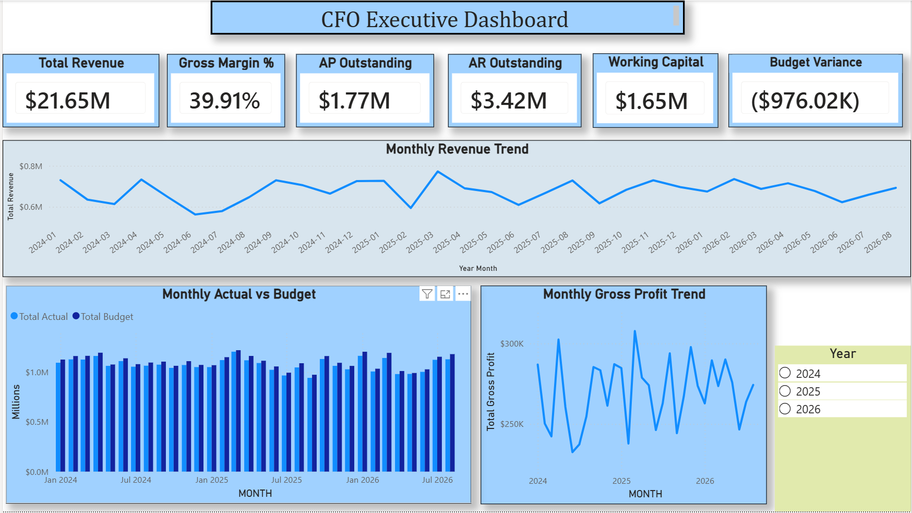
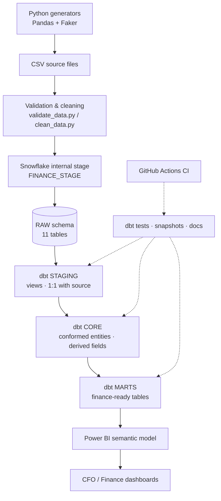
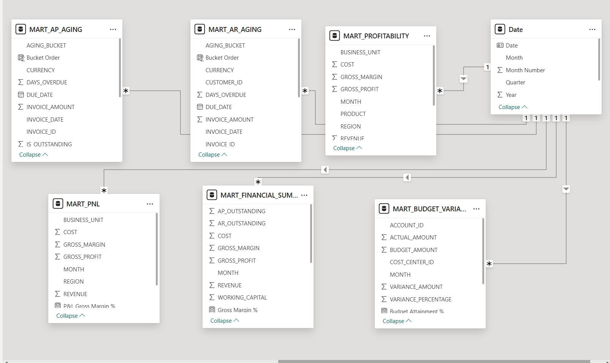
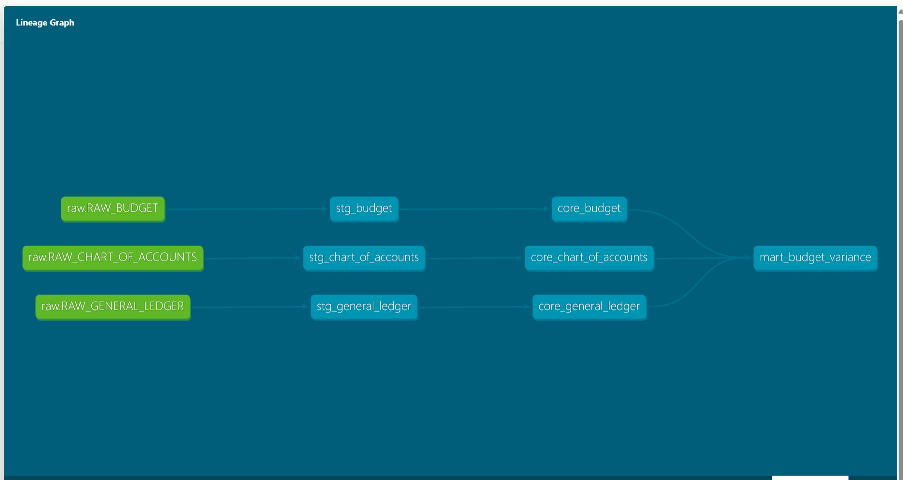

# Finance Analytics / FP&A Analytics Platform

**End-to-end ELT platform for a fictional manufacturer — Python → Snowflake → dbt → Power BI, with automated testing and CI/CD.**




---

## Table of Contents
- [Project Overview](#project-overview)
- [Business Problem](#business-problem)
- [Architecture](#architecture)
- [Technology Stack](#technology-stack)
- [Data Sources](#data-sources)
- [Data Model](#data-model)
- [ELT Pipeline](#elt-pipeline)
- [Data Quality](#data-quality)
- [dbt Models](#dbt-models)
- [Finance KPIs](#finance-kpis)
- [Power BI Dashboard](#power-bi-dashboard)
- [Testing](#testing)
- [CI/CD](#cicd)
- [Security](#security)
- [How to Run](#how-to-run)
- [Repository Structure](#repository-structure)
- [Future Improvements](#future-improvements)

---

## Project Overview

This project builds a centralized finance analytics platform for **Apex Manufacturing Inc.**, a fictional company whose finance data is spread across 11 operational systems and files. It covers the full analytics lifecycle:

- **Synthetic data generation** in Python (Pandas, Faker) for 11 finance datasets, ~57,500 rows, spanning **January 2024 – September 2026**
- **Data-quality framework** that detects, diagnoses, remediates, and re-validates intentionally introduced issues
- **Snowflake warehouse** with a layered RAW → STAGING → CORE → MARTS architecture
- **dbt Core** transformations: 31 models, 42 data tests, sources, an incremental model, and an SCD Type 2 snapshot
- **Power BI** semantic model (shared date dimension, 20+ DAX measures) and a 5-page finance dashboard
- **GitHub Actions** CI pipeline that validates the dbt project (`dbt parse`) on every push and pull request to `main`

---

## Business Problem

Apex Manufacturing's finance team works from disconnected sources — General Ledger, AP, AR, Sales, Budget, Forecast, and master data (accounts, cost centers, entities, customers, vendors). Leadership cannot get a single, trusted view of:

- Revenue, COGS, Gross Profit, Operating Income, and Net Income
- Actual vs. Budget and Actual vs. Forecast performance
- AP/AR aging, working capital, DSO, and DPO
- Profitability by customer, product, business unit, region, and entity

**Goal:** one governed analytics platform where every KPI is defined once, tested automatically, and traceable back to source.

**Delivered in this release:** revenue and gross profit analysis, actual vs. budget, AR/AP aging, working capital, and profitability by product, business unit, and region. Operating income, net income, DSO/DPO, and forecast comparisons are scoped as next steps (see [Future Improvements](#future-improvements)).

---

## Architecture



**Warehouse layout**

| Layer | Schema | Materialization | Purpose |
|---|---|---|---|
| Raw | `FINANCE_ANALYTICS.RAW` | Tables (COPY INTO) | Untouched source data |
| Staging | `FINANCE_ANALYTICS.STAGING` | Views | Rename, cast, trim, standardize — source grain preserved |
| Core | `FINANCE_ANALYTICS.CORE` | Tables / incremental | Conformed business entities with derived fields, keys tested for uniqueness and referential integrity |
| Marts | `FINANCE_ANALYTICS.MARTS` | Tables | Business-ready finance outputs for BI |

Compute: `FINANCE_BI_WH` (X-Small, auto-suspend 60s, auto-resume).

---

## Technology Stack

| Area | Tools |
|---|---|
| Data generation | Python, Pandas, NumPy, Faker |
| Warehouse | Snowflake (internal stage, file formats, COPY INTO) |
| Transformation | dbt Core 1.12, dbt-snowflake |
| BI | Power BI Desktop, DAX, Power Query |
| Version control | Git, GitHub |
| CI/CD | GitHub Actions |
| Auth | Snowflake key-pair (JWT) for dbt & Python; programmatic access token for Power BI |

---

## Data Sources

| File | Rows | Description |
|---|---:|---|
| `chart_of_accounts.csv` | 21 | GL accounts with type and financial statement mapping |
| `cost_centers.csv` | 15 | Department, region, manager |
| `entities.csv` | 3 | Legal entities with country and currency |
| `customers.csv` | 500 | Customer master with segment and signup date |
| `vendors.csv` | 100 | Vendor master with category and payment terms |
| `sales.csv` | 10,000 | Sales transactions with revenue, cost, gross profit |
| `general_ledger.csv` | 30,000 | Journal lines with debit/credit by account, cost center, entity |
| `accounts_payable.csv` | 3,000 | Vendor invoices — paid and unpaid |
| `accounts_receivable.csv` | 5,000 | Customer invoices — paid and unpaid |
| `budget.csv` | 4,455 | Monthly budget by account × cost center (33 months) |
| `forecast.csv` | 4,455 | Monthly forecast, version `BASELINE` |

---

## Data Model

The CORE layer holds one model per business entity. Master-data models act as dimensions and transaction models act as facts, joined on natural keys that dbt tests for uniqueness and referential integrity.

**Dimension-style models:** `core_chart_of_accounts`, `core_cost_centers`, `core_entities`, `core_customers`, `core_vendors`, `core_date`

**Fact-style models and grain**

| Model | Grain |
|---|---|
| `core_sales` / `core_sales_incremental` | One row per sales transaction |
| `core_general_ledger` | One row per GL journal line |
| `core_accounts_receivable` | One row per customer invoice, with outstanding amount, days overdue, and aging bucket |
| `core_accounts_payable` | One row per vendor invoice, with outstanding amount, days overdue, and aging bucket |
| `core_budget` | One row per month × account × cost center |
| `core_forecast` | One row per month × account × cost center × forecast version |

`core_date` is a generated calendar (2024–2026) with year, quarter, month, day-of-week, and period-start columns.

**Power BI semantic model:** a star layout with one shared `Date` dimension related one-to-many to each of the six marts loaded into the report.



---

## ELT Pipeline

1. **Generate** — `python/create_*.py` scripts build 11 CSVs with referential integrity between masters and transactions.
2. **Validate & clean** — `validate_data.py` checks every file; `introduce_data_issues.py` injects known defects; `clean_data.py` remediates them; validation is re-run.
3. **Load** — CSVs are uploaded to the internal stage `FINANCE_STAGE` and loaded into RAW with `COPY INTO` using `CSV_FORMAT`. Row counts are reconciled against source before any dbt work.
4. **Transform** — dbt builds STAGING → CORE → MARTS.
5. **Test** — dbt data tests run as part of `dbt build`.
6. **Serve** — Power BI imports from the MARTS schema.

**Why ELT, not ETL:** raw data lands in Snowflake unchanged, and all business logic lives in version-controlled, tested dbt SQL. Transformations can be rerun or changed without re-extracting data.

---

## Data Quality

The validation framework checks:

- Row counts, nulls, duplicates, data types
- Negative amounts and invalid dates
- Payment date before invoice date; due date before invoice date
- Payment amount greater than invoice amount
- Sales gross profit = revenue − cost
- Foreign keys: Sales/AR → Customers, AP → Vendors, GL → Accounts / Cost Centers / Entities, Budget/Forecast → Accounts
- Forecast version values and debit/credit anomalies

**Workflow demonstrated:** Detection → Diagnosis → Remediation → Re-validation.

### Injected defects

`introduce_data_issues.py` deliberately corrupts clean data to prove the framework catches real-world errors:

| Dataset | Injected defect | Check that catches it |
|---|---|---|
| Accounts Receivable | Payment amount set to invoice amount **+ $5,000** (overpayment) | `payment_amount <= invoice_amount` |
| Sales | Gross profit calculated as revenue **+** cost instead of revenue − cost | `gross_profit = revenue − cost` |
| General Ledger | Account reference changed to non-existent **`ACC999`** | GL → Chart of Accounts foreign key |

Each defect is **detected** by `validate_data.py`, **diagnosed** to the row and rule that failed, **remediated** by `clean_data.py`, and confirmed by **re-running validation** before loading to Snowflake.

### Case study: unrealistic budget data

| Stage | What happened |
|---|---|
| **Detection** | The Budget & Forecast dashboard showed **Budget $243.6M vs. Actual $22.6M — 9.28% attainment**, which is not plausible for an operating budget. |
| **Diagnosis** | Traced to `create_budget.py`, which assigned `uniform(10,000, 100,000)` to every month × account × cost center cell regardless of activity. A second issue was found in `mart_budget_variance`: actuals and budget were not on the same account scope. |
| **Remediation** | Aligned the mart so actuals and budget both use COGS + Operating Expense accounts. Regenerated the budget from GL actuals with an 85–125% planning variance, with **$0 budget for the 168 cells with no GL activity** (no random fallback). Regenerated the forecast from the corrected budget. Originals kept as `*_v1_random` for traceability. |
| **Re-validation** | Reloaded RAW, rebuilt downstream dbt models and tests, and reconciled the totals across CSV, Snowflake, and Power BI. |

| Metric | Before | After |
|---|---:|---:|
| Actual | $22.60M | $34.40M |
| Budget | $243.60M | $35.37M |
| Forecast | — | $36.21M |
| Budget Attainment | 9.28% | 97.24% |

Actual totals reconciled **to the cent** ($34,396,855.34) between the regenerated source file and the Snowflake mart.

---

## dbt Models

| Layer | Models |
|---|---|
| **Staging** (11, views) | `stg_chart_of_accounts`, `stg_cost_centers`, `stg_entities`, `stg_customers`, `stg_vendors`, `stg_sales`, `stg_accounts_receivable`, `stg_accounts_payable`, `stg_general_ledger`, `stg_budget`, `stg_forecast` |
| **Core** (13) | `core_chart_of_accounts`, `core_cost_centers`, `core_entities`, `core_customers`, `core_vendors`, `core_date`, `core_sales`, `core_sales_incremental`, `core_general_ledger`, `core_accounts_receivable`, `core_accounts_payable`, `core_budget`, `core_forecast` |
| **Marts** (7) | `mart_pnl`, `mart_budget_variance`, `mart_ap_aging`, `mart_ar_aging`, `mart_working_capital`, `mart_financial_summary`, `mart_profitability` |

**Key dbt features**

- **Sources** — all 11 RAW tables declared in `models/staging/sources.yml` and referenced with `{{ source('raw', ...) }}`
- **Custom schema routing** — `generate_schema_name` macro writes each layer to its own schema (`STAGING`, `CORE`, `MARTS`) instead of dbt's default `<target>_<custom>` naming
- **Incremental model** — `core_sales_incremental` is materialized as `incremental` with `unique_key='sales_id'`. After the first full load, each run only picks up rows at or after the latest loaded `sales_date` and merges them on the key, so reprocessed rows update rather than duplicate
- **SCD Type 2 snapshot** — `snap_customers` uses the `check` strategy on `customer_name`, `city`, `state`, and `customer_segment`. When any of them changes, dbt closes the old row and inserts a new current one, tracked with `dbt_valid_from` and `dbt_valid_to`
- **Lineage documentation** — `dbt docs generate` builds the model catalog and lineage graph

```bash
dbt build          # run models + tests
dbt docs generate  # build lineage docs
dbt docs serve
```



---

## Finance KPIs

| KPI | Definition | Source |
|---|---|---|
| Revenue, Cost, Gross Profit | Sums from sales transactions; Gross Profit = Revenue − Cost | `mart_pnl`, `mart_profitability`, `mart_financial_summary` |
| Gross Margin % | Gross Profit ÷ Revenue | Same |
| Actual | GL debit − credit on COGS and Operating Expense accounts | `mart_budget_variance` |
| Budget Variance | Actual − Budget | `mart_budget_variance` |
| Variance % | (Actual − Budget) ÷ \|Budget\| | `mart_budget_variance` |
| Budget Attainment % | Actual ÷ Budget | Power BI measure |
| AR / AP Outstanding | Invoice amount − payment amount | `mart_ar_aging`, `mart_ap_aging` |
| Working Capital | AR Outstanding − AP Outstanding (simplified: inventory and cash are out of scope for this dataset) | `mart_working_capital`, `mart_financial_summary` |

**Aging buckets (AR & AP):** Current, 1–30, 31–60, 61–90, 90+ days past due, calculated from the due date against the current date. Paid invoices are labelled `Paid` and excluded from the aging charts.

Actual and budget use the same account scope, driven by `account_type` in the chart of accounts, so the comparison is like-for-like.

---

## Power BI Dashboard

Power BI connects to the Snowflake **MARTS** schema in Import mode.

| Page | Highlights |
|---|---|
| **CFO Executive Dashboard** | Revenue, Gross Margin %, AP and AR Outstanding, Working Capital, Budget Variance; monthly revenue, gross profit, and actual vs. budget trends; year slicer |
| **P&L Analysis** | Revenue, gross profit, and gross margin by month, business unit, and region |
| **Budget & Forecast** | Actual vs. budget by month, budget attainment, variance by cost center |
| **AP & AR** | Outstanding balances, aging buckets, invoice status |
| **Profitability** | Revenue, gross profit, and margin by product, business unit, and region |

**Semantic model**

- A dedicated `Date` table, marked as the date table, related one-to-many to all six marts with single-direction filters
- Explicit DAX measures for every KPI (no implicit aggregations)
- A sort-by column so aging buckets display in age order
- September 2026 holds a single day of data, so it is excluded from trend visuals to avoid a misleading drop. KPI cards still reconcile to the warehouse totals

---

## Testing

**dbt — 42 data tests**, defined in `models/core/core.yml` and run with every `dbt build`:

- `unique` and `not_null` on every primary key
- `relationships` (referential integrity): Sales/AR → Customers, AP → Vendors, GL → Accounts / Cost Centers / Entities, Budget/Forecast → Accounts / Cost Centers

**Python — business-rule validation** in `validate_data.py`, run before data is loaded:

- `gross_profit = revenue − cost`
- `payment_amount <= invoice_amount`
- `due_date >= invoice_date`, `payment_date >= invoice_date`
- no negative amounts, valid forecast versions, valid foreign keys

---

## CI/CD

`.github/workflows/` defines a **dbt CI** workflow that runs on every push and pull request to `main`:

1. Check out the repository
2. Set up Python 3.11
3. Install pinned versions: `dbt-core==1.12.5`, `dbt-snowflake==1.12.1`
4. Generate a CI-only `profiles.yml` with placeholder values (no real credentials)
5. Run `dbt parse` to validate project structure, Jinja, `ref()`/`source()` dependencies, and YAML configs

`dbt parse` does not need a warehouse connection, so it catches broken models, missing references, and invalid config **before** anything reaches `main`, without storing any Snowflake credentials in GitHub.

**Next stage (planned):** add a Snowflake connection through **GitHub Secrets** (key-pair auth) so CI can also run `dbt compile` and `dbt build` against a dedicated CI schema.

---

## Security

- **dbt and Python** authenticate with Snowflake **key-pair (JWT) authentication**. The private key is encrypted with a passphrase and stored outside the repository; dbt reads its path and passphrase from environment variables via `env_var()`.
- **`profiles.yml`** lives in `~/.dbt/`, outside the repo.
- **Power BI** uses a Snowflake **programmatic access token** because the account enforces MFA on password logins.
- `.gitignore` excludes `.env` files, private keys (`*.p8`, `*.pem`), and any local `profiles.yml`.

---

## How to Run

```bash
# 1. Clone and set up
git clone https://github.com/Aastha953/finance-analytics-snowflake-dbt.git
cd finance-analytics-snowflake-dbt
python -m venv .venv
.venv\Scripts\Activate.ps1        # Windows PowerShell
pip install -r requirements.txt

# 2. Generate and validate data
python python/create_chart_of_accounts.py   # ...repeat for each create_*.py
python python/validate_data.py

# 3. Load to Snowflake: PUT the CSVs to @FINANCE_STAGE, then COPY INTO the RAW tables
#    (python/reload_raw_table.py reloads a table in one transaction)

# 4. Configure dbt
#    Create ~/.dbt/profiles.yml (key-pair auth) and set:
#    HOME_SNOWFLAKE_KEY, SNOWFLAKE_PRIVATE_KEY_PASSPHRASE,
#    SNOWFLAKE_ACCOUNT, SNOWFLAKE_USER (used by python/reload_raw_table.py)
cd finance_analytics
dbt debug
dbt build
dbt docs generate && dbt docs serve
```

---

## Repository Structure

```
finance-analytics-snowflake-dbt/
├── data/                  # Generated CSV source files
├── python/                # Generators, validation, cleaning, loaders
├── finance_analytics/     # dbt project
│   ├── models/
│   │   ├── staging/
│   │   ├── core/
│   │   └── marts/
│   ├── snapshots/
│   └── macros/
├── powerbi/               # Power BI report (.pbix)
├── docs/images/           # Dashboard, data model, and lineage screenshots
├── .github/workflows/     # CI pipeline
├── requirements.txt
└── README.md
```

---

## Future Improvements

- Reconcile GL costs to sales revenue, then add Operating Income and Net Income to `mart_pnl`
- Add a forecast mart for Actual vs. Forecast and Forecast vs. Budget
- Add DSO and DPO, plus customer- and entity-level profitability
- Add dbt singular tests for business rules and `accepted_values` on status fields
- Introduce surrogate keys and `dim_` / `fct_` naming in the core layer; add fiscal calendar attributes
- Make open-invoice aging more realistic in the generators (most open balances currently fall in 90+)
- Extend CI to run `dbt build` against Snowflake via GitHub Secrets, in an isolated CI schema
- Orchestrate the pipeline with Airflow or Dagster
- Add dbt source freshness with a load-timestamp column
- Replace the PAT network-policy bypass with a permanent Snowflake network policy
- Dedicated least-privilege roles (`LOADER`, `TRANSFORMER`, `REPORTER`) instead of `ACCOUNTADMIN`
- Multi-currency conversion using daily FX rates
- Additional forecast versions and rolling forecasts
- Deploy dbt docs to GitHub Pages
- Publish the report to Power BI Service with scheduled refresh

---

## Author

**Aastha Kale** — Business Systems Analyst
[Portfolio](https://aastha-kale-bi.vercel.app/) · [LinkedIn](https://linkedin.com/in/aastha-kale-01516b216/) · [GitHub](https://github.com/Aastha953)
